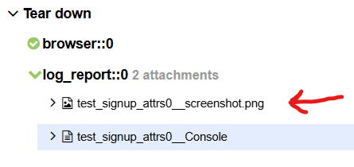

# eBay Functional Automation Testing Suite

## Overview
This project is a robust automation testing framework designed to validate key features and user workflows on eBay. It serves as a small example of a testing platform, focusing on a limited set of functionalities of eBay's website. This repository is not intended for full coverage but rather to demonstrate how to set up and execute automated tests for specific scenarios.

## Example of Test Running

To see an example of the test in action, watch the following video:


https://github.com/user-attachments/assets/55ece915-f6b4-42fd-b20f-7d7db2715555


This video demonstrates the execution of the `test_buy_product_page` test, showcasing the product search and checkout functionalities.

## Key Features to Automate
1. **User Authentication:**
   - Login and Logout: Test valid and invalid login scenarios.
   - Sign-Up: Automate the user registration process using dummy data.

2. **Product Search and Navigation:**
   - Search Functionality: Test searching for items using different keywords.

3. **Checkout:**
   - Automate the checkout process, focusing on entering shipping and payment details.

4. **Error Handling and Edge Cases:**
   - Validate error messages for invalid actions, such as adding unavailable items to the cart or leaving mandatory fields blank during checkout.


## Tools & Technologies
- **Selenium WebDriver:** For browser-based automation.
- **Python:** For writing test scripts.
- **Pytest:** For structuring and executing test cases.
- **Allure Reports:** For generating detailed and visually appealing test reports.
- **GitHub Actions:** To integrate a CI/CD pipeline for automatic execution of test scripts.

## Installation
To install and set up the project, follow these steps:

1. Clone the repository:
    ```sh
    git clone https://github.com/julianemran/ebay-testing.git
    ```
2. Navigate to the project directory:
    ```sh
    cd ebay-testing
    ```
3. Create a virtual environment:
    ```sh
    python -m venv venv
    ```
4. Activate the virtual environment:
    - On Windows:
        ```sh
        venv\Scripts\activate
        ```
    - On macOS/Linux:
        ```sh
        source venv/bin/activate
        ```
5. Install dependencies:
    ```sh
    pip install -r requirements.txt
    ```

## Usage
To run the tests, use the following commands:

- Set environment variables:
    ```sh
    export EBAY_EMAIL=your_username
    export EBAY_PASS=your_password
    ```

- Run all tests:
    ```sh
    pytest
    ```

- Run a specific test file:
    ```sh
    pytest tests/filename_test.py
    ```

- Generate Allure reports:
    1. Run the tests with the `--alluredir` option to specify the directory for storing the results:
        ```sh
        pytest --alluredir=allure-results
        ```
    2. Generate the Allure report from the stored results:
        ```sh
        allure generate allure-results
        ```

## Allure Reports
Allure reports provide a comprehensive overview of the test results. Below are examples of Allure report outputs:


### Key Sections in the Report
- **Test Results:** Displays the status of each test case (passed, failed, skipped).
- **Trends:** Shows the historical trend of test results over time.
- **Dashboards:** Provides a summary of the test execution, including total tests, passed tests, and failed tests.
- **Screenshots:** Includes screenshots for failing tests to help with debugging.

### Viewing Screenshots in Allure Reports
To view screenshots for failing tests in the Allure report, follow these steps:

1. Open the Allure report:
    [Allure Report](https://julianemran.github.io/ebay-testing)

2. Navigate to the failing test case in the report. The screenshot will be available under the "Tear Down" section of the test case details.
    


## Folder Structure
The project directory structure is as follows:
```
ebay-testing/
├── tests/                  # Test cases
│   ├── login_page/         # Tests for the login functionality
│   ├── product_page/       # Tests for the product page functionality
│   ├── signup_page/        # Tests for the signup functionality
│   ├── frontend_report.py  # Frontend report generation
│   └── ...                 # Other test files
├── src/                    # Source code
│   ├── pages/              # Page object models
│   ├── __init__.py         # Init file for src
│   └── ...                 # Other source files
├── .github/                # GitHub workflows
│   └── workflows/          # CI configuration
├── env/                    # Virtual environment
├── requirements.txt        # Project dependencies
├── README.md               # Project documentation
└── ...                     # Other project files
```

## Acknowledgements
- [Selenium](https://www.selenium.dev/)
- [Allure](https://docs.qameta.io/allure/)
- [pytest](https://docs.pytest.org/en/stable/)
- [GitHub Actions](https://github.com/features/actions)
- [eBay](https://www.ebay.com/)
